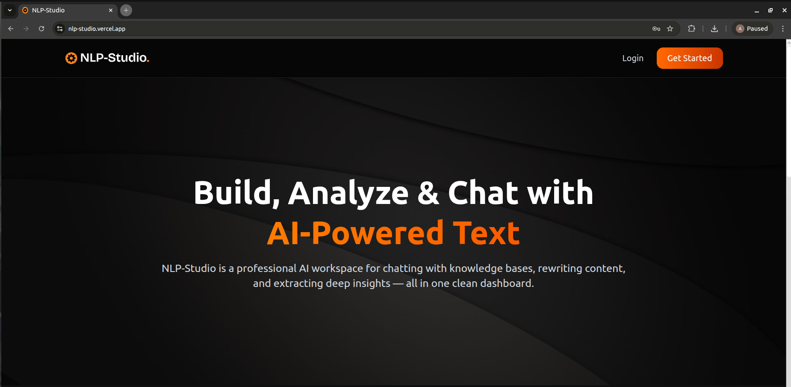
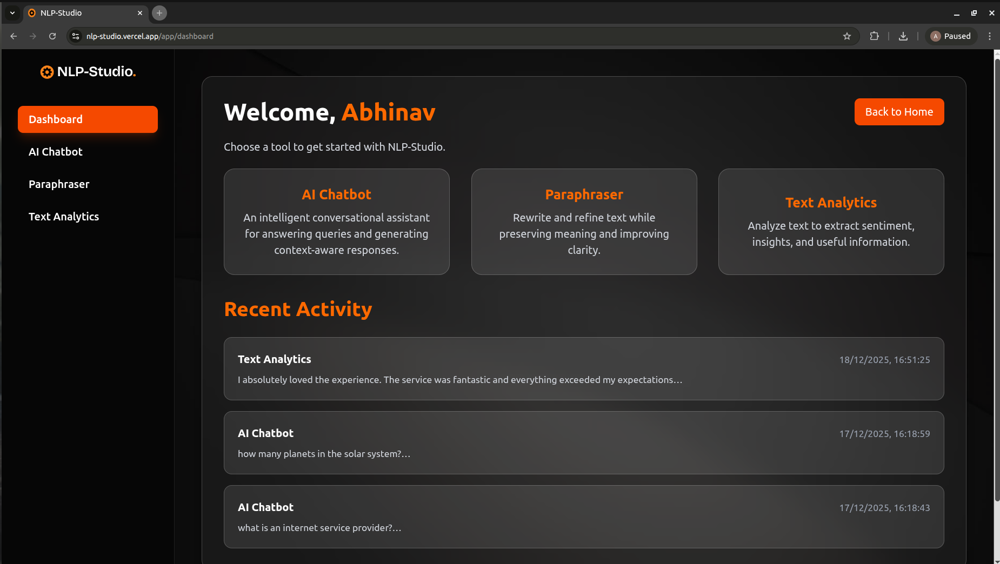
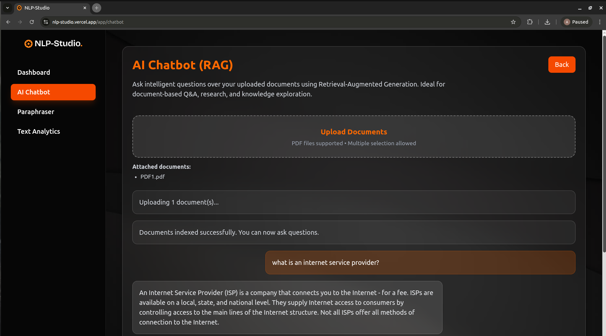
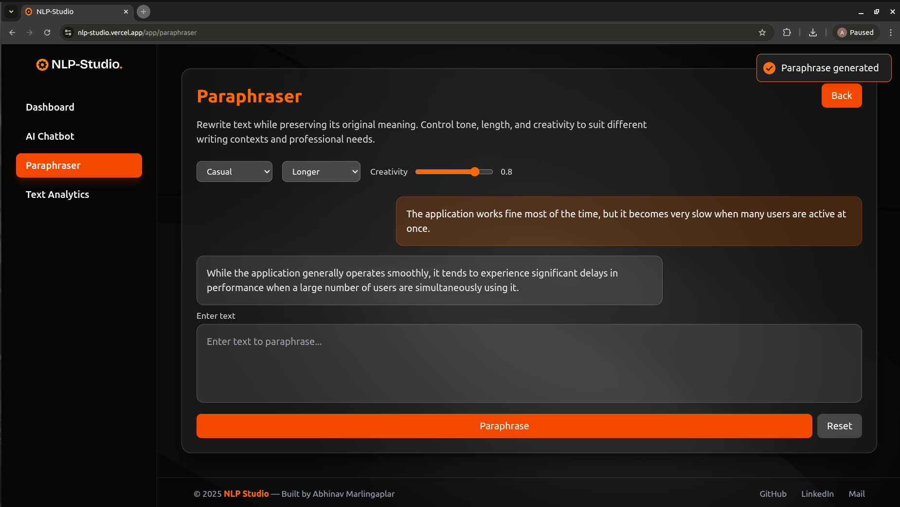
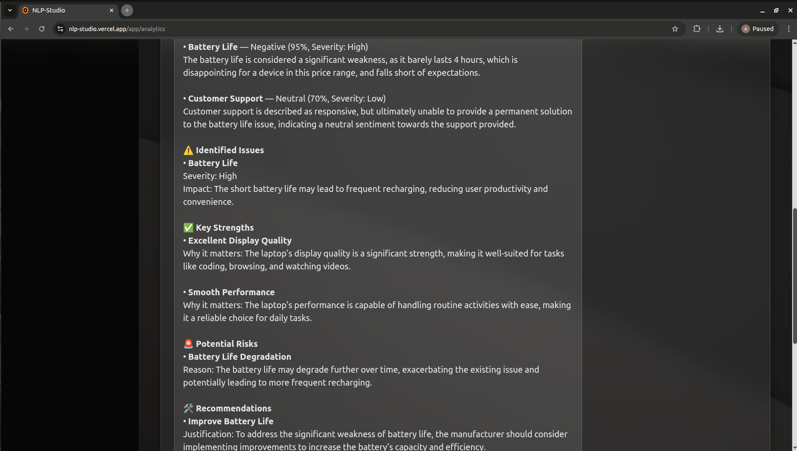

# NLP Studio – Multi-Service NLP Platform

---

## Overview

NLP Studio is a full-stack NLP platform built using the MERN stack and modern large language model tooling.  
The application provides multiple NLP services through a single interface, including a Retrieval-Augmented Generation (RAG) chatbot, text paraphrasing, and text analytics.

The project focuses on building a production-ready AI system rather than a prototype, with emphasis on authentication, scalable architecture, and real-world deployment challenges such as CORS, token management, and environment-based configuration.

Live Demo (Frontend): https://nlp-studio.vercel.app  
Backend API: https://nlp-studio.onrender.com  

---

## Key Features

- RAG Chatbot using Xenova Transformers for embeddings, Supabase Vector DB for semantic retrieval, and Groq LLM APIs to deliver context-aware, low-latency responses over custom knowledge.
- Paraphrasing Service powered by Groq LLMs, enabling semantic-preserving text rewriting for content and productivity use cases.
- Text Analytics Module leveraging LLM-based language understanding for tasks such as summarization and linguistic analysis.
- Secure Authentication System implemented with JWT access tokens and HTTP-only refresh tokens, following production-grade session management practices.
- Scalable Cloud Deployment with Vercel (frontend) and Render (backend), featuring modular APIs, CORS-secure communication, and SPA routing.

---

## Technologies Used

| Technology | Purpose |
|----------|--------|
| MongoDB | Persistent storage for users and application data |
| Express.js | REST API layer and authentication logic |
| React.js (Vite) | Frontend single-page application |
| Node.js | Backend runtime |
| Groq API | LLM inference |
| Xenova Transformers | Embedding generation |
| Supabase Vector Database | Vector storage and semantic search for RAG |
| JWT | Access and refresh token-based authentication |
| Tailwind CSS | UI styling |
| Vercel | Frontend deployment |
| Render | Backend deployment |

---

## Authentication Design

The authentication system uses a standard production-grade JWT workflow:

- Short-lived access tokens are issued on login and stored client-side.
- Long-lived refresh tokens are stored as HTTP-only cookies.
- Axios interceptors automatically refresh expired access tokens.
- Cross-origin authentication is secured using strict CORS configuration and cookie policies.

This approach mirrors common patterns used in modern SaaS applications.

---

## Sample Screenshots of the Application Interface

    
    
    
    
    
    

---

## Conclusion

NLP Studio demonstrates the design and deployment of a real-world, AI-driven web application that integrates large language models, vector databases, and secure authentication within a full-stack architecture. The project emphasizes practical engineering decisions such as modular service design, production-ready authentication, and cloud deployment, reflecting patterns commonly used in modern AI-powered SaaS systems.

---

## License

This project is licensed under the MIT License. See the `LICENSE` file for more details.
