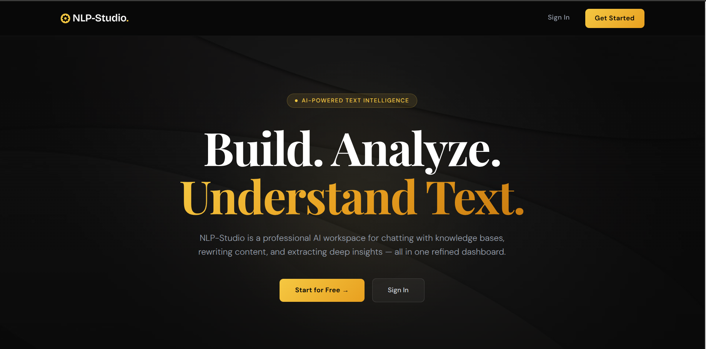
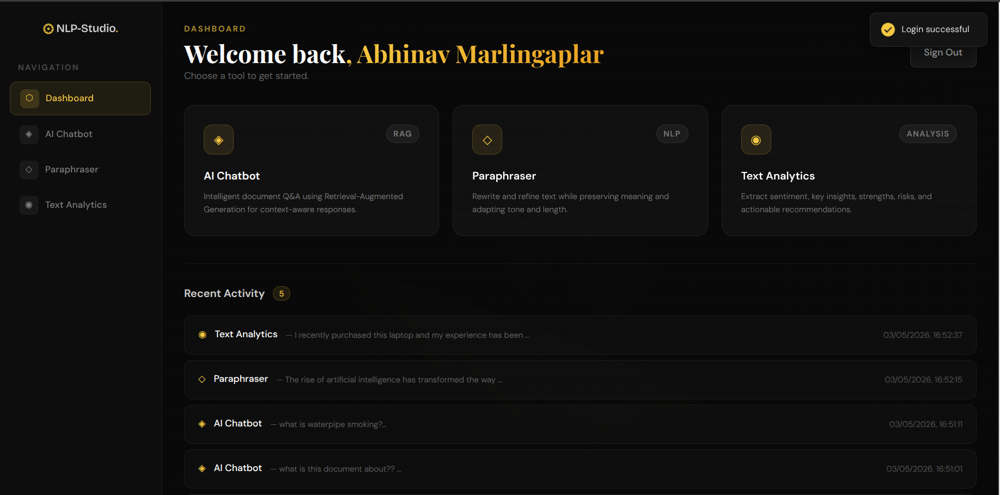
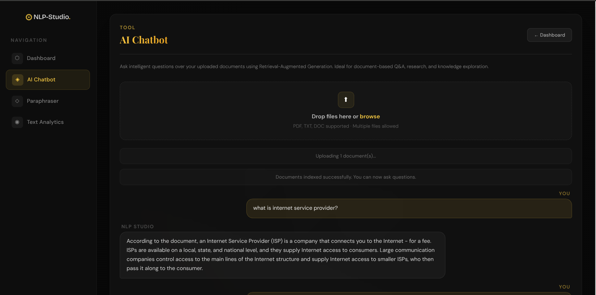
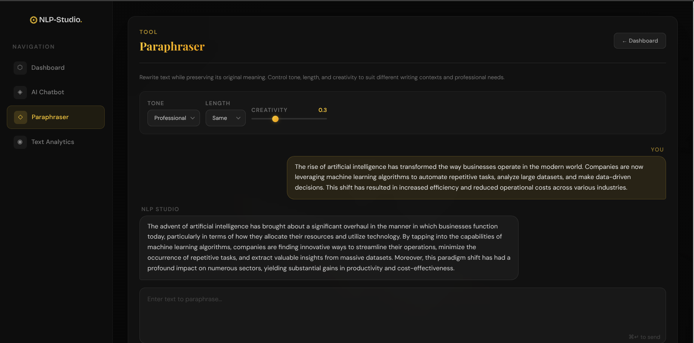
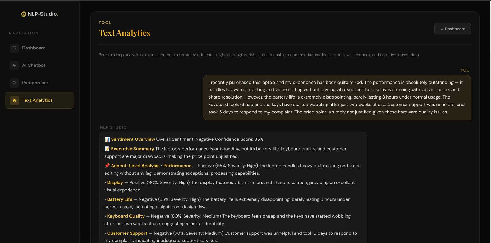
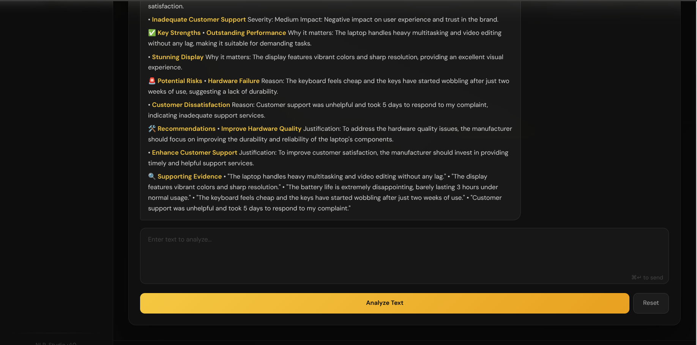

# NLP Studio — Multi-Service NLP Platform

🔗 [Live Demo](https://nlp-studio.vercel.app) · ⚙️ [Backend API](https://nlp-studio.onrender.com)

---

## Overview

NLP Studio is a full-stack AI-powered NLP platform built on the MERN stack with Groq LLM APIs. It combines a RAG-based document chatbot, intelligent paraphrasing, and deep text analytics into a single cohesive application — engineered for real-world deployment with session isolation, Redis caching, JWT authentication, and automated infrastructure warm-up.

---

## Features

### RAG Chatbot
Upload PDF documents and interact with them through a conversational interface with full memory. The system embeds documents using Xenova Transformers (MiniLM L6 v2), stores vectors in Supabase, and retrieves contextually relevant chunks to ground Groq LLM responses. Conversation history is maintained per session via Redis, enabling natural multi-turn dialogue.

### Paraphrasing Service
Rewrite any text across three control axes — tone (formal, casual, neutral, professional), length (shorter, same, longer), and creativity (0–1). Each submission generates 3 structural variants simultaneously — Direct, Restructured, and Reinterpreted — letting users pick the approach that fits their context.

### Text Analytics
Deep multi-layer analysis returning a structured report with overall sentiment, confidence score, urgency score (0–10), NPS estimate (−100 to 100), aspect-level breakdown, key issues with severity ratings, strengths, potential risks, and prioritised recommendations with effort tags.

### Authentication
Production-grade JWT auth with short-lived access tokens in memory and long-lived refresh tokens in HTTP-only session cookies. Axios interceptors handle silent token refresh. CORS and cookie policies are configured for secure cross-origin communication between Vercel and Render.

### Infrastructure
- **Service layer architecture** — business logic decoupled from HTTP handling
- **Redis caching** — embeddings cached 24h, LLM responses cached 1h per session
- **Session isolation** — all user data scoped by userId across Redis, Supabase, and localStorage
- **Warm-up system** — cron jobs ping health endpoints every 10 minutes to prevent Render sleep and Supabase inactivity

---

## Tech Stack

| Layer | Technology |
|---|---|
| Frontend | React.js, Vite, Tailwind CSS |
| Backend | Node.js, Express.js |
| Database | MongoDB Atlas |
| Vector Database | Supabase (pgvector) |
| LLM Inference | Groq API (llama-3.3-70b, llama-3.1-8b) |
| Embeddings | Xenova Transformers — MiniLM L6 v2 |
| Caching | Upstash Redis |
| Auth | JSON Web Tokens (JWT) |
| Frontend Deploy | Vercel |
| Backend Deploy | Render |
| Cron Scheduling | cron-job.org |

---

## Screenshots

  
  
  
  
  
  

---

## License

MIT License — see `LICENSE` for details.

## Author

**Abhinav Marlingaplar** · [GitHub](https://github.com/Abhinav-Marlingaplar)
